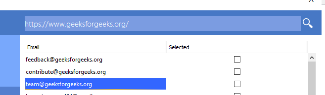
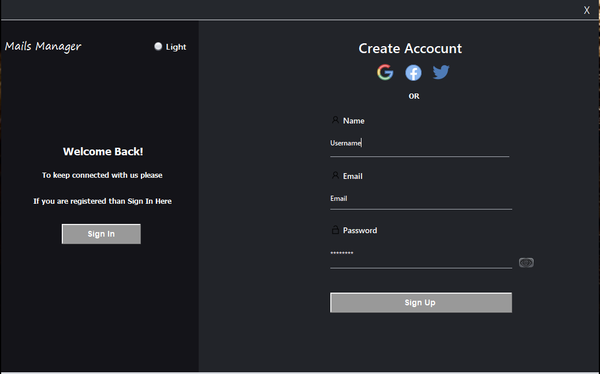

# Mails Manager
## _---"makes yours mail marketing easy"---_

# Intro:
 **Mails Manager** is developed for the purpose of scrapping the emails dynamically from any web-provided URL. Although it has the ability to send up to 500 emails at a time and you will select the emails that you want to send either you will send the emails manually enter them.

# Working:
Follwing are the steps that are releted to works
    
- First, you have to register by entering some basic information.
- After log in you have to configure your Gmail Account . (it is mentioned in Guidelines)
- You have to enter the valid URL and wait for a while then after validating the URL it scraps the mails from the website.
- Then you will able to send the mails to the selected participants.

## Features

- For UI : [Swing](https://docs.oracle.com/javase/7/docs/api/javax/swing/package-summary.html) is used!
- For Sending Mails : [Javax Mail Jar](https://javaee.github.io/javamail/)
- For Validating the Emails [Common Validations for Rejax and Mails](https://commons.apache.org/proper/commons-validator/)
- For Scrapping the Mails [JSOUP](https://jsoup.org/)

#### Note:

> 
> formatting syntax is to make it as readable
> as possible. The idea is that a
> Markdown-formatted document should be
> publishable as-is, as plain text, without
> looking like it's been marked up with tags
> 

## Plugins

| Plugin | README |
| ------ | ------ |
| Guidlines |  |
| Start |  |
| SigIn |  |
| Admin Login |  |
| UI Panel |  |
| Scrape  Mails |  |
| Buisness Data |  |
| User Data |  |
| Report |  |
| Dark Mode Demo |  |

## License
[MIT](https://choosealicense.com/licenses/mit/)

